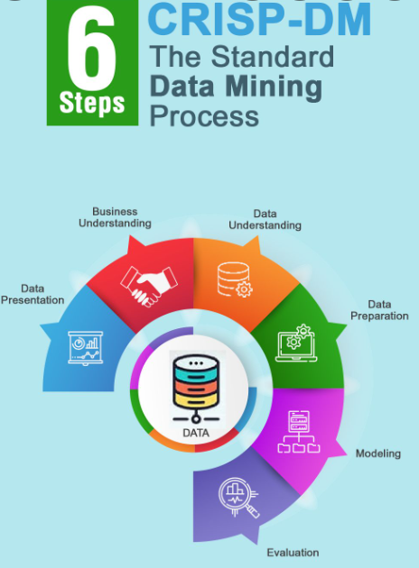

## Tehtävä: Opiskelijaryhmän tiedot
* **Kaikkien ryhmään** kuuluvien opiskelijoiden nimet ja JAMK:n opiskelijatunnukset
    * TODO: Opiskelija 1 + opiskelijatunnus
    * TODO: Opiskelija 2 + opiskelijatunnus
    * TODO: Opiskelija 3 + opiskelijatunnus
    * TODO: Opiskelija 4 + opiskelijatunnus

Huom! Vain yksi vastaus tähän ryhmätehtävään per ryhmä. Kaikki vastaukset arvioidaan koko ryhmän jäsenille samalla tavalla.

#### Tehtävien pisteytys

* Opintojakson opettaja laskee pisteet palautuksen jälkeen

Tehtävien maksimipistemäärät:

| Teht. 1 | Teht. 2 | Teht. 3 | Yhteensä |
|---------|---------|---------|----------|
| 5p      | 5p      | 5p      | max. 15p |

--------------------

## Tehtävien 1-5 alustus 

Tehtävissä **1-5** on kuvitteellinen tilanne, jossa **ryhmänne on konsultoimassa vesiyhtiötä**.

* Datalähteenä on **Yorkshire Water** -yhtiön julkaisemat vedenkäyttötilastot vuosilta **2012-2015**
* Datalähteenä tehtävässä on: https://datamillnorth.org/dataset/yorkshire-water-daily-customer-meter-data--local-area-

Huom! Voitte käyttää tulosten analysoinnissa annettua [Yorkshire Water Jupyter Notebook -dokumenttia](jupyter_data/YorkshireWater_data_analysointi.ipynb). 
Sitä voi ja pitääkin hieman muuttaa data- ja tulosanalyysia varten.

Seuraavassa hieman lisätietoa datasta sen tarjoajan sivuilta:

* A dataset showing daily water consumption readings in cubic metres (m3) from internal and/or external meters in a discrete study in two distribution management areas (DMAs) in Yorkshire between 2013 and 2015.
* This data is taken from a live localised project investigating water use. 
* The data has been anonymised to remove personal data and make it Data Protection Act compliant. 
* The DMAs are also anonymised to prevent any open data activity affecting the results of the ongoing study the data has been taken from.

### Videomateriaali 
Katso videomateriaali aina ennen tehtävien tekemistä. Tämä on tärkeää, koska on hyvä pyrkiä ymmärtämään käsitteitä ennen vastausten kirjoittamista. 
* Tehtävien lopussa on lista hyödyllisistä videoista ja muista lähteistä
* Tehtävissä keskeisin asia on **CRISP-DM -prosessi**
* Ennen tehtäviä kannattaa katsoa videot **01-05**.

### Tehtävät 1-5 vs. CRISP-DM standardi prosessimalli

--------------------
# Tehtävä 1: Ongelman kuvaaminen  (Business Understanding)

Haetaan vastaukset kysymyksiin: 
* Millainen data on kyseessä?
* Missä yhteydessä tästä datasta voi olla hyötyä?
* Millainen liiketoiminta on datan taustalla?
* Mitä kaikkea datasta voidaan oppia?
* Mitä datasta voidaan nähdä?
* Mitä datasta voidaan tunnistaa?
* Voidaanko datasta havaita jotain poikkeavaa?
* Tarvitaanko tämän lisäksi jotakin muuta lisätietoa?

Palautetaan vastaus repositoryyn annettuun palautuspäivämäärään mennessä:
* palautus tehdään MarkDown-formaatissa (tarkenne .md), jolloin kuvat ja kaaviot linkitetään dokumenttiin. 

**Lähteitä:**
* Video - **05 CRISP-DM Alku**
* Katso Myös Video **10: Tekoälyprojektin roolitus**

## Tehtävä 1: Vastaus 

TODO: Kirjoita vastauksesi MarkDown-formaatissa, jolloin sen voi liittää suoraan tehtävädokumenttiin.
* [MarkDown-tutorial](https://www.markdownguide.org/basic-syntax/).
* Liitä vastaukseen myös tarvittavat kuvakaappaukset yms.

--------------------
# Tehtävä 2: Datan kuvaaminen (Data Understanding)

* Millaisia muuttujia on datassa?
* Mitä arvoa on käytetty täytearvona?
* Millaisia korrelaatioita datasta löytyy?
* Tarkistelee dataa tietyillä aikaväleillä (esim. viikko, kuukausi tai vuosi).
* Havaintojen tueksi voi liittää visualisoitua dataa
* Mieti mitä tällä datalla voidaan mahdollisesti tehdä?

Palautetaan vastaus repositoryyn annettuun palautuspäivämäärään mennessä:
* palautus tehdään MarkDown-formaatissa (tarkenne .md), jolloin kuvat linkitetään dokumenttiin

Datan käsittely:
* Katso julkaistu [Yorkshire Water Jupyter Notebook -dokumentti](jupyter_data/YorkshireWater_data_analysointi.ipynb) 
* Tätä voitte käyttää apuna datan ymmärtämisessä
* Sitä voi myös täydentää lisähavaintojen ja -analyysin tekemiseen (voi itse ohjelmoida lisää)

**Lähteitä:**
* Video - **05 CRISP-DM Loppuosa**

Kannattaa myös katsoa seuraavat videot:
* **18: Data ja sen laatu**
* **19: Huono Data**
* **20: Laadun arviointi ja formaatit**

## Tehtävä 2: Vastaus 

TODO: Kirjoita vastauksesi MarkDown-formaatissa, jolloin sen voi liittää suoraan tehtävädokumenttiin.
* [MarkDown-tutorial](https://www.markdownguide.org/basic-syntax/).
* Liitä vastaukseen myös tarvittavat kuvakaappaukset yms.

--------------------------

# Tehtävä 3: Datan valmistelu (esikäsittely, Data Preparation)

* Miten valmistelet datan?
* Mitä piirteitä tai muuttujia erotat datasta jatkokäsittelyä varten?
* Voidaanko jotakin jättää datasta pois?
* Millainen rakenne datassa on?
* Millainen dataformaatti on kyseessä?
* Kannattaako data pilkkoa osiin?
* Joudutaanko dataa mahdollisesti muuttamaan ennen sen jatkojalostusta?
* Mieti tilastotietojen hyötykäyttöä?
* Havaintojen tueksi voi liittää kuvia datasta

Palautetaan vastaus repositoryyn annettuun palautuspäivämäärään mennessä:
* palautus tehdään MarkDown-formaatissa (tarkenne .md), jolloin kuvat linkitetään dokumenttiin

**Lähteitä:**
* Video - **06 CRISP-DM Keskiosa** (Datan valmistelun kuvaus)

Myös kannattaa katsoa seuraavat videot:
* **16: Aineisto**
* **17: Validointi**

Katso julkaistu [Yorkshire Water Jupyter Notebook -dokumentti](jupyter_data/YorkshireWater_data_analysointi.ipynb)

## Tehtävä 3: Vastaus 

TODO: Jos kirjoitat vastauksen MarkDown-formaatissa, sen voi liittää suoraan tehtävädokumenttiin.
* [MarkDown-tutorial](https://www.markdownguide.org/basic-syntax/).

----------