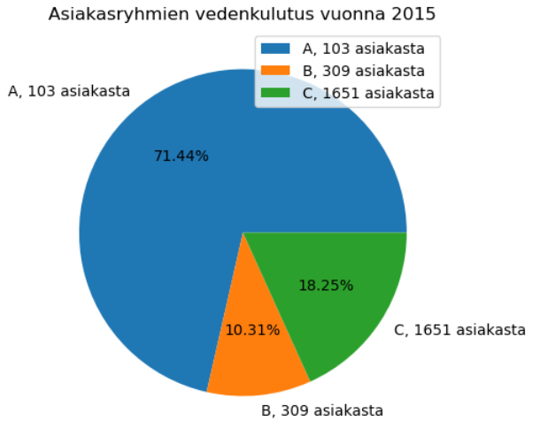
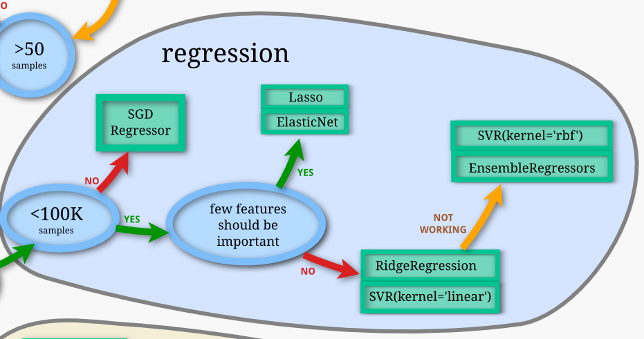
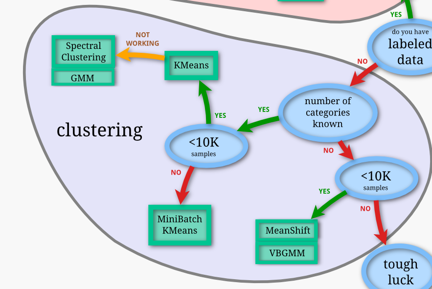

## Tehtävä: Opiskelijaryhmän tiedot
* **Kaikkien ryhmään** kuuluvien opiskelijoiden nimet ja JAMK:n opiskelijatunnukset
    * Onni Roivas AB0410
    * Adham Naderi AB8911

Huom! Vain yksi vastaus tähän ryhmätehtävään per ryhmä. Kaikki vastaukset arvioidaan koko ryhmän jäsenille samalla tavalla.

#### Tehtävien pisteytys

* Opintojakson opettaja laskee pisteet palautuksen jälkeen
* Alla kootusti tehtävien maksimipistemäärät

| Teht. 4 | Teht. 5 | Yhteensä |
|---------|---------|----------|
| 5p      | 5p      | max. 10p |

--------------------

# Tehtävä 4: Datan mallintaminen (Modeling)

Tehtävä on varmasti hieman hankala, mutta mm. näistä valinnoista sitten riippuu paljon
se lopputulos eli kuinka paljon asiakas hyötyy tehdystä data-analyysistä sekä koneoppimismallista.
* Miten mallintaisit datan?
* Millä tavalla päästään haluamaasi lopputavoitteeseen? 
* Regressio?
* Ennustaminen?
* Luokittelu?
* Ryhmittely?
* Ryhmien tunnistaminen datasta?
* Kuvaile Mitä tämän jälkeen tapahtuu CRISP-DM -mallin mukaan (pääpiirteissään)
* Havaintojen tueksi voi liittää kuvia/koodia datasta

Palautetaan vastaus repositoryyn annettuun palautuspäivämäärään mennessä:
* Palautus MarkDown-formaatissa (tarkenne .md), jolloin kuvat linkitetään dokumenttiin

**Lähteitä:**
* Video - **05 CRISP-DM Keskiosa**

Myös kannattaa katsoa:
* **09: KDD-prosessi**
* **11: Tietokone**
* **12: Matematiikka**
* **13: Työkalut**
* **14: Suurteholaskenta**

## Tehtävä 4: Vastaus 

### Datan mallintaminen

[Vedenkulutusdata ABC](./jupyter_data/Data/Vedenkulutusdia.ipynb)

Datan mallinnuksen ensimmäinen askel on valita sopiva mallinnusmenetelmä. Valinta riippuu siitä, mitä tietoa halutaan saada datasta. Luokittelussa luodaan malli, joka jakaa datan ennalta määritettyihin luokkiin. Ryhmittelyssä pyritään löytämään malli, joka jakaa datan tuntemattomiin ryhmiin. Regressiossa taas tavoitteena on löytää malli, joka ennustaa jatkuva-arvoisen muuttujan lukuarvoja.

#### Regressio

Regressiossa rakennetaan malli, joka ennustaa jatkuvaluontoisen muuttujan arvoja. Vedenkulutusdatan tapauksessa regressiota voidaan käyttää ennustamaan tulevaa vedenkulutusta sekä yksittäisten kiinteistöjen että kokonaiskulutuksen osalta. Ennen regressiota on mahdollista tehdä ryhmittelyä, jolloin ennusteet voidaan kohdistaa eri asiakasryhmien kulutustottumuksiin. Parhaiten vesilaitoksen liiketoimintaa tukee juurikin vedenkulutusta ennustava regressiomalli.

#### Luokittelu

Vedenkulutusdatassa on vain vähän muuttujia, mikä rajoittaa syvällisempää perehtymistä selittäviin tekijöihin. Luokittelumenetelmien käytössä on tärkeää tietää etukäteen datan jaettavat luokat, jotta mallin kehittäminen onnistuu koulutus- ja validointidatan avulla. Luokkien määrä riippuu siis käytettävissä olevasta datasta.

Yksi selkeästi erottuva luokka vedenkulutusdatassa on jakelualue, mutta koska tämä tieto on jo tiedossa vesiyhtiöllä jokaisen kiinteistön osalta, sen ennustaminen ei ole tarpeellista. Sen sijaan asiakkaita voidaan luokitella vedenkulutuksen perusteella. Yksi tapa tehdä tämä on jakaa asiakkaat kolmeen luokkaan ABC-analyysin periaatteella. Luokka A sisältää eniten vettä käyttävät asiakkaat (esim. 5% kaikista asiakkaista), luokka B seuraavaksi eniten käyttävät asiakkaat (esim. 15% asiakkaista) ja loput kuuluvat luokkaan C. Tämän ajatuksen takana on, että ryhmiin A ja B kuuluvat asiakkaat ovat taloudellisesti merkittävimpiä. Alla olevassa kuvassa on tehty analyysi vuoden 2015 vedenkulutusdatan perusteella. Mittauskohteet, eli kiinteistöt, on anonymisoitu numeroimalla ne luvuilla 1-2160.

Kuvasta selviää, että 5% asiakkaista kuluttaa yli 70% vedestä. Nämä asiakkaat ovat erityisen merkityksellisiä infran ylläpidon kannalta. Asiakkaat on jaettu kolmeen ryhmään tässä ABC-analyysissa. Tarvittaessa ryhmiä voisi kuitenkin olla enemmän, jos halutaan tarkempi luokittelu asiakaskunnalle.

Asiakkaiden luokittelu menneen kulutuksen perusteella ei vaadi tässä tapauksessa ollenkaan koneoppimisen menetelmiä. Jos jaottelua halutaan tehdä tulevaisuuden kulutuksen perusteella esimerkiksi kuukausitasolla, voidaan datasta erottaa kuukausi ja viikonpäivä omiksi sarakkeiksi, ja näiden avulla voitaisiin mahdollisesti rakentaa jonkinlainen malli. Kuitenkin, olisi hyödyllistä saada asiakkaista vielä enemmän lisätietoja. Tällaista tietoa löytyy [kyselydatasta](https://datamillnorth.org/dataset/water-usage-survey), mutta se koskee vain kotitalouksia, ja suurin osa näistä asiakkaista todennäköisesti kuuluu esimerkiksi suurimpaan kulutusluokkaan, kuten aiemmin mainittiin. Valitettavasti kyselydatan tietoja ja kulutusdataa ei voida yhdistää keskenään.

#### Ryhmittely

Ryhmittelyssä datapisteet jaetaan ennalta määräämättömiin ryhmiin. Vedenkulutusdatan tapauksessa olisi mielenkiintoista nähdä, miten kiinteistöt muodostavat ryhmiä kulutuslukemiensa perusteella. Koska muuttujia on vähän, voi kuitenkin olla haastavaa löytää selittäviä tekijöitä, jotka kuvaavat eri ryhmien kiinteistöjen ominaisuuksia.

Kyselydata sisältää tietoa kiinteistöjen vesikalusteista ja vedenkulutustottumuksista, mutta sitä ei voi suoraan yhdistää vedenkulutusdataan, koska kyselydata on kerätty eri aikana ja kattaa erilaisen kiinteistövalikoiman. Lisäksi kyselydatassa ei ole avainta, jonka avulla kiinteistökohtaisia tietoja voitaisiin yhdistää vedenkulutusdataan. Näitä kahta datasettiä voisi kuitenkin yhdistää klusteroinnin avulla, mutta se vaatisi enemmän laadullista tutkimusta kuin perinteisen koneoppimismallin kehittämistä.

Toisaalta ryhmittelyssä kiinteistöt jaetaan sen perusteella, miten ne käyttävät vettä. Tällöin voimme löytää erilaisia asiakasryhmiä ja muokata vesilaitoksen tarjoamia palveluja näiden asiakasryhmien tarpeisiin. Esimerkiksi tapahtuma- ja vapaa-ajanviettopaikat, kuten jalkapallostadionit, konserttisalit ja kylpylät, ovat kiinteistöjä, joissa vettä kuluu paljon ja kulutus voi vaihdella huomattavasti päiväkohtaisesti. Näille asiakkaille on erityisen tärkeää taata vesipalveluiden sujuvuus ja häiriöttömyys.

### CRISP-DM -mallin mukainen eteneminen

#### Mallinnusmenetelmä

Kuten aiemmin mainittiin, vesilaitoksen liiketoimintaa parhaiten tukee vedenkulutusta ennustava regressiomalli. Vedenkulutusennusteet auttavat vesilaitosta valmistautumaan tulevaisuuteen, kuten varmistamaan riittävän infran ja henkilöstömäärän sekä arvioimaan toiminnan ja luonnonvarojen tasapainoa. Ryhmittely tarjoaa myös arvokasta tietoa asiakkaista ja mahdollistaa eri palvelutasojen tarjoamisen eri asiakasryhmille. On tärkeää tunnistaa kriittiset asiakkaat ja huolehtia heidän palvelutasostaan, samalla kun tunnistetaan eri asiakasryhmien erityspiirteitä ja mukautetaan palvelut vastaamaan kunkin ryhmän tarpeita.

Koneoppimisen näkökulmasta hyvä valinta mallinnusmenetelmäksi on Pythonin scikit-learn -kirjasto, joka tarjoaa laajan valikoiman koneoppimismalleja. Mallin valintaan vaikuttavat sekä käytettävän datan luonne että tavoite, johon mallia käytetään. Scikit-learn -kirjaston [dokumentaatio](https://scikit-learn.org/stable/tutorial/machine_learning_map/index.html) sisältää ohjeita mallin valintaan datan ominaisuuksien perusteella.

Vedenkulutuksen ennustamiseen sopivaksi malliksi voisi valita Lasso tai ElasticNet -mallit.

Asiakasryhmien muodostamiseen puolestaan MeanShift tai VBGMM -mallit voivat olla hyviä vaihtoehtoja.

#### Loppueteneminen

Mallinnusmenetelmän valitsemisen jälkeen tulee huomioida ainakin seuraavia asioita:

1. Datan jakaminen
* Data jaetaan selkeästi koulutus-, validointi- ja testausjoukkoihin. Koulutusdatalla opetetaan mallia, validointidatalla optimoit hyperparametrit ja testausdatalla arvioit mallin lopullista suorituskykyä.
2. Mallin skaalautuvuus
* On mietittävä, miten malli skaalautuu, kun käsiteltävä data kasvaa. Joissakin kohtaa mallin koulutus voi olla hyvin resurssivaativaa.
3. Dokumentointi ja toistettavuus
4. Kouluttamisen ajanhallinta

Sekä kehittäjät että vesilaitoksen edustajat tarkastelevat saatuja tuloksia yhdessä, minkä jälkeen sovitaan tarvittavat jatkotoimenpiteet. Tavoitteena on löytää mahdolliset epäkohdat tai parannusmahdollisuudet mallin suorituskyvyssä tai sen soveltuvuudessa asiakkaan tarpeisiin. Asiakkaan palaute auttaa ymmärtämään, miten malli vastaa heidän tarpeisiinsa ja odotuksiinsa. Palaute voi paljastaa uusia näkökulmia tai vaatimuksia, joita ei ole alun perin otettu huomioon. Tuloksien tarkastelussa pyritään arvioimaan saavutettiinko asetettu tavoite. Kun tuloksia on tarkasteltu ja parannuksia on tehty, on todennäköistä, että suoritetaan uusi iteraatiokierros CRISP-DM -mallin mukaisesti. Tämä tarkoittaa, että prosessi aloitetaan alusta, ja dataa käsitellään, valmistellaan ja analysoidaan uudelleen.

----------
# Tehtävä 5: Tulosten arviointi (Evaluation / Deployment)

Tehtävässä arvioidaan kaksi osaa:

### 5.1: Projektin tulosten arviointi

* Esitellään tiivistetysti projektin keskeiset tulokset
* Millaiseksi arvioitte projektin tulokset tässä vaiheessa?
* Kuinka helppoa tästä on jatkaa kohti toteutusta?
* Ketkä saatuja tuloksia arvioivat, jos halutaan, että projektille saataisiin rahoitus?
* Miten osoittaisit projektin hyödyn liiketoiminnalle?
* Mitä toimenpiteitä suosittelisitte konsultin roolissa asiakasyritykselle?

Käyttöönoton vaiheet: 

* Millaiset työkalut tarvitaan tuotetun järjestelmän käyttöönottoon
* Miten järjestelmä otettaisiin käyttöön?
* Miten järjestelmän ylläpito järjestetään?
* Kuinka mahdolliset virheet ja ongelmatilanteet korjataan?

### 5.2: Jupyter Notebook päivitykset
* Jupyter Notebook - päivitykset, joita ryhmänne teki tämä projektin aikana
* Jupyter Notebook -muutosten antama lisäarvo ajatellen projektin mahdollista jatkoa

## Tehtävä 5: Vastaus

### Tulosten arviointi

#### Tulokset ja toteutusvaihe

Tässä vaiheessa projektissa on käyty läpi datan mallinnusprosessi ja esitelty keskeiset tulokset. Mallinnusmenetelminä on valittu regressio vedenkulutuksen ennustamiseen ja ryhmittely asiakasryhmien muodostamiseen. Regressiolla pyritään ennustamaan tulevaa vedenkulutusta sekä yksittäisten kiinteistöjen että kokonaiskulutuksen osalta. Ryhmittelyssä taas on tunnistettu erilaisia asiakasryhmiä vedenkulutuksen perusteella, mikä voi auttaa vesilaitosta kohdentamaan palveluitaan asiakkaille paremmin.

Data-analysointiprojektin ja CRISP-DM -prosessimallin avulla on saatu selville tärkeää tietoa vedenkulutuksesta ja asiakaskäyttäytymisestä. Työssä on myös hyödynnetty tehokkaasti Jupyter Notebook ja Gitlab -työkaluja, mikä on edistänyt projektin etenemistä. [Jupyter Notebookit ja muu data](./jupyter_data/Data/)

Datan tutkimiseen ja analysointiin on käytetty paljon aikaa, mikä luo perustan toteutusvaiheelle. Hyvälaatuinen data mahdollistaa koneoppimismallien soveltamisen ja vertailun nopeasti. Seuraavaksi tuloksia ja niiden analysointia olisi hyvä jatkaa yhdessä vesilaitoksen edustajien kanssa. Heidän palautteensa ja tarpeidensa huomioiminen varmistaa, että lopullinen malli vastaa parhaiten liiketoiminnan vaatimuksia.

#### Rahoitus

Projektille saadakseen rahoitusta olisi tärkeää arvioida tuloksia ja niiden hyötyjä monesta näkökulmasta. Yrityksen johto on tärkeä sidosryhmä rahoituksen kannalta, sillä he tekevät päätökset ja näkevät liiketoiminnallisen arvon projektin tuloksille. Lisäksi asiakkailla voi olla merkittävä rooli rahoituksen saamisessa, koska heidän tarpeidensa ja palautteensa perusteella projektin hyödyt liiketoiminnalle voidaan todentaa. Myös tutkimusorganisaatiot voivat olla potentiaalisia rahoittajia, mikäli projekti tarjoaa merkittäviä innovaatioita tai uusia ratkaisuja vesihuollon alalla.

Projektin hyödyt liiketoiminnalle voivat olla merkittäviä. Datan perusteella voidaan havaita ongelmia, kuten vuotoja tai tukoksia, reaaliaikaisesti. Tämä auttaa välttämään vedenhukan ja mahdollisten vahinkojen syntymisen. Kuluttajille voidaan tarjota datasta visuaalisesti hyviä yhteenvetoja, joiden avulla he voivat seurata omaa vedenkulutustaan ja mahdollisesti säästää vettä. Tämä lisää asiakastyytyväisyyttä ja sitouttaa asiakkaita vesilaitoksen palveluiden käyttöön.

Konsultin roolissa suosittelemme asiakasyritykselle seuraavia toimenpiteitä:

1. Dataa kannattaa kerätä monipuolisemmin, mikä voi tuoda uusia näkökulmia ja parantaa mallin ennustekykyä.
2. Kyselytutkimuksen datan yhdistäminen kulutusdataan voisi tuottaa arvokasta tietoa, joka auttaisi ymmärtämään asiakkaiden käyttäytymistä ja tarpeita paremmin. Tietosuoja- ja GDPR-näkökulmat tulee kuitenkin ottaa huomioon.
3. Reaaliaikaisen datankeruun avulla voidaan parantaa tiedon ajantasaisuutta ja antaa nopeampaa palautetta asiakkaille.
4. Ennustaminen historiallisen datan pohjalta auttaa varautumaan tulevaisuuden tarpeisiin ja optimoimaan toimintaa.

Datan mallinnusprojektissa on edetty hyvin, ja projektin tuloksista voi olla merkittävää hyötyä vesilaitoksen liiketoiminnalle. On tärkeää jatkaa tulosten kehittämistä ja testaamista yhdessä asiakkaan kanssa sekä pitää mielessä liiketoiminnalliset tarpeet koko projektin ajan.

### Käyttöönoton vaiheet

#### Työkalut

Tuotetun järjestelmän käyttöönotto vaatii tiettyjä työkaluja ja ympäristöjä, jotka mahdollistavat koneoppimismallin ajamisen ja sen tehokkaan toiminnan. Kuten aiemmin mainittiin, data jaetaan koulutus-, testi- ja validointijoukkoihin: Tämä varmistaa, että koneoppimismalli koulutetaan oikeanlaisella datalla ja testataan luotettavasti ennen käyttöönottoa. Työkaluna tässä toimii siis Python-kirjasto Scikit-learn. Sitä täydentämään tarvitaan myös muita kirjastoja datan analysointia ja visualisointia varten. Näitä ovat muun muassa taulukoiden ja matriisien käsittelyyn ja matemaattisiin funktioihin keskittynyt Numpy, interaktiiviseen visualisointiin erikoistunut Matplotlib sekä Pandas, joka tarjoaa työkaluja numeeristen taulukoiden ja tietorakenteiden käsittelyyn.

Vesilaitos voi käyttää kehitettyä mallia kahdella eri tavalla. Ensimmäinen vaihtoehto on ajaa malli Jupyter-työkirjasta. Tämä käyttötapa on toimiva, mutta vaatii käyttäjältä tiettyä teknistä osaamista. Toinen vaihtoehto on toteuttaa kehitetystä mallista erillinen ohjelma käyttöliittymineen. Käyttäjäystävällisyyden kannalta tämä on parempi vaihtoehto. Toisaalta tällaisen ohjelman avulla mallin päivittäminen uudella datalla ei ole mahdollista. Siksi, jos päivitys uudella datalla on tärkeää, JupyterLab-työkirja on suositeltavampi toteutustapa.

#### Käyttöönotto

Järjestelmän käyttöönottoon liittyy useita tärkeitä vaiheita, joiden avulla varmistetaan sen sujuva ja luotettava toiminta. Ensimmäinen tärkeä vaihe on valmistella ja suorittaa koneoppimismallit Web Service -palveluna. Tämä tarkoittaa sitä, että valmistellut koneoppimismallit asennetaan palvelimelle tai pilvipalveluun, jotta ne ovat saatavilla ja voivat palvella ennustepalveluita verkon kautta. Web Service -palveluna tarjoaminen mahdollistaa joustavan ja reaaliaikaisen pääsyn ennusteisiin, mikä on tärkeää, kun järjestelmää käytetään liiketoiminnassa.

Pilvipalvelut ovat erinomainen tapa hyödyntää tehokkaita ajoympäristöjä järjestelmän käyttöönotossa. Pilvipalvelut tarjoavat joustavan skaalautuvuuden, mikä tarkoittaa, että resursseja voi kasvattaa tarpeen mukaan ja palvelua voi skaalata suurempaan käyttöön ilman suuria investointeja omiin palvelimiin. Tämä on erityisen hyödyllistä, kun järjestelmän käyttö vaatii suurta laskentatehoa, kuten koneoppimismallien suorittamisessa. Pilvipalveluiden avulla voidaan myös optimoida kustannuksia, sillä resursseja voi vähentää vähäisemmän käytön aikana. Näitä palveluita tarjoaa muun muassa [Amazon Web Services](https://aws.amazon.com/), [Microsoft Azure](https://azure.microsoft.com/en-us) tai [Google Cloud](https://cloud.google.com/).

Lisäksi on tärkeää harkita suorituskyvyn optimointia järjestelmän käyttöönotossa. Koneoppimismallit voivat olla laskentateholtaan vaativia, joten tehokkaiden ajoympäristöjen valitseminen on ratkaisevan tärkeää. Tässä voi tulla kyseeseen esimerkiksi suuresti laskentatehoa tarjoavien tietokoneiden käyttö, kuten supertietokoneiden tai erikoisvalmisteisten laskentaklustereiden hyödyntäminen. Suorituskyvyn optimointi voi olla myös osa pilvipalveluiden käyttöä, sillä pilvipalveluissa on mahdollista valita erilaisia palvelupaketteja, jotka tarjoavat erilaisia laskentaresursseja.

Jotta pilvipalveluiden käyttöönotto olisi mahdollisimman sujuvaa, on tärkeää suunnitella ja konfiguroida pilvipalvelu oikein. Tässä vaiheessa kannattaa hyödyntää pilvipalvelun tarjoamia ohjeita ja suosituksia, jotta resurssit olisivat optimaalisessa käytössä ja järjestelmä toimisi mahdollisimman tehokkaasti.

#### Ylläpito

Järjestelmän ylläpito on olennainen osa sen pitkäaikaista toimivuutta ja luotettavuutta. Ylläpidon tulee olla jatkuvaa, ja siihen tulee nimetä vastuutettu tiimi, jolla on tarvittava osaaminen koneoppimismallien ylläpidosta ja päivityksistä. Ylläpito voi olla organisaation omaa henkilöstöä tai ulkopuolisen konsulttiyhtiön vastuulla tuntilaskutuksella.

Virheiden raportointi ja korjaus ovat olennainen osa järjestelmän ylläpitoa. Kaikki havaitut virheet ja ongelmat tulee raportoida ja dokumentoida huolellisesti. Sopimuksessa tulee määritellä selkeästi, kuinka virheet korjataan ja millaisessa aikataulussa. Erityisen tärkeää on korjata kriittiset virheet mahdollisimman nopeasti ja tehokkaasti.

Testien dokumentointi on tärkeää kaikkien testien ja testitulosten dokumentoimiseksi huolellisesti. Vaikka joku malli hylättäisiin tällä hetkellä, se voi tulla käyttökelpoiseksi myöhemmin, kun data on riittävän laadukasta. Dokumentointi auttaa ymmärtämään tehdyt päätökset ja parantaa prosessin läpinäkyvyyttä.

---------------------
## Tehtävät 1-5 - esitys
### Videoesitys 

Tehdään **Videoesitys** (n. 10 min) projektista ja sen tuloksista.
Videolla voi kertoa tiivistetysti teidän koko "prosessista" eli tehtävistä 1-5.

* Tavoitteena on selventää projektin tuloksien pohdintaa arvioijalle (ts. opettajalle).
* Esityksessä tiivistetään tärkeimmät opit ja löydökset teidän ryhmän kannalta
* Esityksen muoto on vapaa ja ryhmän päätettävissä 
  * "käsikirjoitus", mitä aikoo esittää, kannattaa tehdä ennen esittämistä

### Esitys ei pakollinen 
 Videota ei tällä kurssilla erikseen arvioida, mutta silti toivon, että ryhmät tekevät sen.
ts. Sen tekeminen ei ainakaan laske arvosanaa. Esitys ei kuitenkaan ole pakollinen syksyllä 2022.

